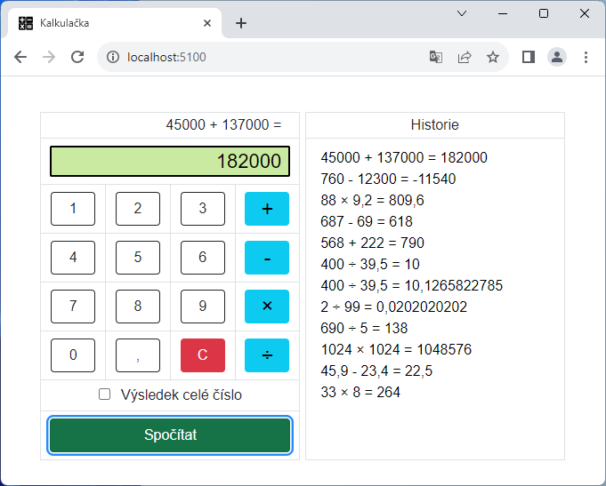
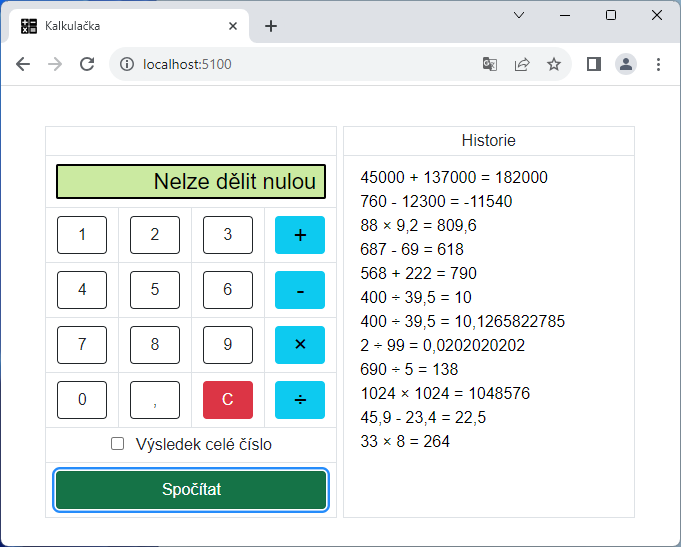
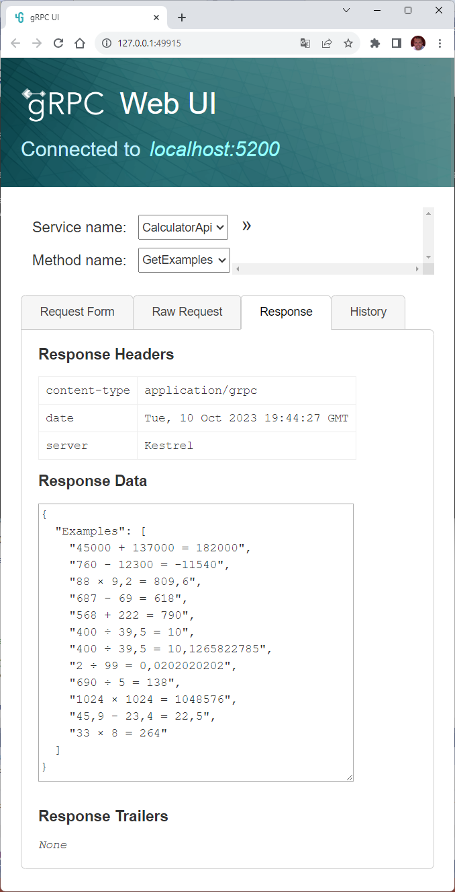

# Kalkulačka

Webová kalkulačka na základní aritmetické operace. 

Naprogramováno v jazyce C# v prostředí Microsoft .NET 8 

- App/Client - ASP.NET Core (Blazor Web App) 
- API - gRPC
- Databáze - Microsoft SQL Server (MS SQL)
- ORM - Dapper (Stored procedures)
- Unit testy - NUnit
- Nasazení - Docker kontejner pomocí Docker Compose
- Sledování chyb - Sentry

